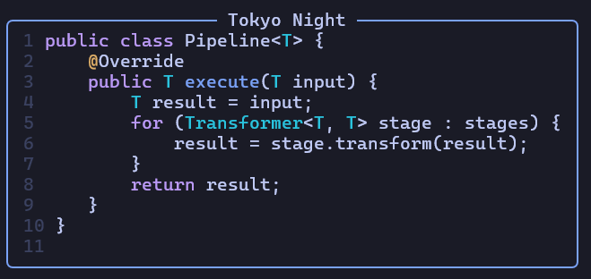
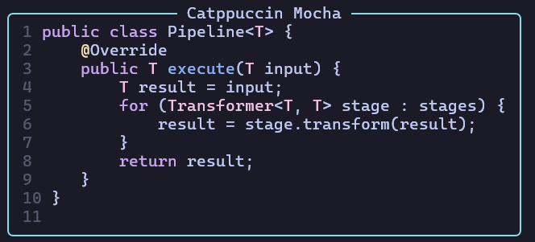

# Veneer

A Java syntax highlighting library that parses and styles Java source code with ANSI color codes. Built on top of [JavaParser](https://github.com/javaparser/javaparser) and the [Clique](https://github.com/kusoroadeolu/Clique) styling library.

---





## Installation

Add the dependency to your `pom.xml`:

```xml
<dependency>
    <groupId>io.github.kusoroadeolu</groupId>
    <artifactId>parser</artifactId>
    <version>1.0.0</version>
</dependency>
```

---

## Usage

### Basic

```java
JavaSyntaxHighlighter highlighter = new JavaSyntaxHighlighter();
String styled = highlighter.highlight(sourceCode);
System.out.println(styled);
```

### With a theme

```java
JavaSyntaxHighlighter highlighter = new JavaSyntaxHighlighter(SyntaxThemes.CATPPUCCIN_MOCHA);
highlighter.print(sourceCode);
```

### Without line numbers

```java
JavaSyntaxHighlighter highlighter = new JavaSyntaxHighlighter(false);
String styled = highlighter.highlight(sourceCode);
```

### With both options

```java
JavaSyntaxHighlighter highlighter = new JavaSyntaxHighlighter(SyntaxThemes.NORD, false);
String styled = highlighter.highlight(sourceCode);
```

### From a file

```java
JavaSyntaxHighlighter highlighter = new JavaSyntaxHighlighter();
String styled = highlighter.highlight(Path.of("MyClass.java"));
highlighter.print(Path.of("MyClass.java"));
```

---

## Themes

The following built-in themes are available via `SyntaxThemes`:

| Constant                        | Description         |
|---------------------------------|---------------------|
| `SyntaxThemes.DEFAULT`          | IntelliJ-inspired   |
| `SyntaxThemes.CATPPUCCIN_MOCHA` | Catppuccin Mocha    |
| `SyntaxThemes.GRUVBOX`          | Gruvbox Dark        |
| `SyntaxThemes.NORD`             | Nord                |
| `SyntaxThemes.TOKYO_NIGHT`      | Tokyo Night         |

### Custom themes

Implement the `SyntaxTheme` interface to define your own:

```java
public class MyTheme implements SyntaxTheme {
    @Override public AnsiCode keyword()       { return Clique.rgb(255, 100, 100); }
    @Override public AnsiCode stringLiteral()        { return Clique.rgb(100, 200, 100); }
    @Override public AnsiCode numberLiteral() { return Clique.rgb(100, 150, 255); }
    @Override public AnsiCode comment()       { return Clique.rgb(120, 120, 120); }
    @Override public AnsiCode annotation()    { return Clique.rgb(200, 200, 50);  }
    @Override public AnsiCode method()        { return Clique.rgb(255, 200, 100); }
    @Override public AnsiCode gutter()        { return Clique.rgb(80, 80, 80);    }
    @Override public AnsiCode types()         { return Clique.rgb(170, 180, 200); }
    @Override public AnsiCode constants()     { return Clique.rgb(150, 120, 170); }
}
```

Then pass it to the highlighter:

```java
JavaSyntaxHighlighter highlighter = new JavaSyntaxHighlighter(new MyTheme());
```

---

## Token categories

The following token categories are styled:

| Category        | Examples                                  |
|-----------------|-------------------------------------------|
| Keywords        | `public`, `void`, `class`, `return`, ...  |
| Strings         | `"hello"`, text blocks, Javadoc           |
| Number literals | `42`, `3.14f`, `0xFF`, ...                |
| Comments        | `//`, `/* */`                             |
| Annotations     | `@Override`, `@SuppressWarnings`, ...     |
| Method names    | Declared method and constructor names     |
| Type references | `String`, `List`, `MyClass`, ...          |
| Constants       | `static final` fields                     |

---

## Known quirks

### `var` keyword
JavaParser does not treat `var` as a reserved keyword — it's a reserved type name, so it gets assigned an `IDENTIFIER` token kind rather than a keyword kind. The highlighter handles this with an explicit text check, so `var` will be styled correctly in all standard use cases:

```java
var x = 10;
var list = new ArrayList<String>();
for (var item : list) { ... }
try (var stream = new FileInputStream("file.txt")) { ... }
```

One edge case that is **not** handled: when `var` is used as a variable or field name (which is legal since it's not a reserved keyword):

```java
var var = "sneaky"; // the second 'var' will still be styled as a keyword
```

Detecting this correctly would require stateful context tracking, which is out of scope for a token-range based highlighter.

---

## Incomplete or partial syntax

The highlighter does a **best-effort** pass on incomplete or malformed code. It will still tokenize and style what it can, but some categories may not render fully:

- **Keywords, strings, literals, comments, and annotations** — these are derived purely from token kinds and will render correctly regardless of whether the code is valid.
- **Method names, type references, and constants** — these require a successful AST walk to identify. On partial or invalid input, JavaParser may not resolve them, so they will fall back to unstyled text.

For example:

```java
// Keywords and literals highlight correctly, but the method name may not
void main() {
    int a = 1;
```

```java
// 'String' may not get its type color here since AST resolution is incomplete
String result = someService.fetch(userId
```

In short: the more structurally complete your snippet is, the more accurate the highlighting will be. For most real-world use cases — full files, complete method bodies, or class declarations, the output should be fully styled.

---

### Method names that share a type name
If a method is declared with the same name as a known type (e.g., `public void List() {}`), it will be colored as a type rather than a method. This is intentional, in ambiguous cases, type coloring takes priority. In practice this shouldn't matter since naming methods after types is uncommon.

### Local variables that share a method name
If a local variable shares a name with a declared method (e.g., `int foo = 5` where `foo()` is also a method), references to the variable may be colored as a method. Resolving this correctly would require full symbol resolution, which is out of scope for this highlighter. Most comparable libraries have the same limitation.

## Requirements
- Java 21+
- JavaParser 3.26.3